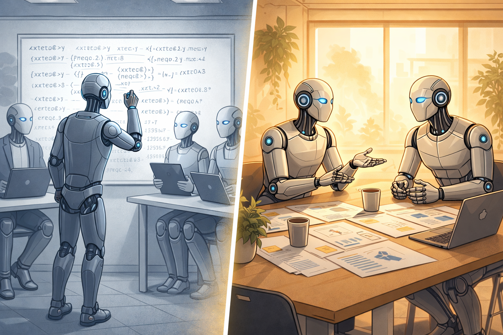

Some of the best hires I ever made, I never saw write a line of code.

For years, I was obsessive about technical assessments. Whiteboard interviews. Take-home tests. Live coding sessions. I thought: if you can't prove you can code in front of me, how do I know you're any good?

I had a standard battery of questions. I'd give candidates problems and watch them struggle through solutions. At every stage, the failure rates were incredibly high. And I felt confident I was filtering for technical excellence.

Then, ahead of a major hiring drive a few years ago, some senior leaders in our organisation shared what they believed influenced great hiring decisions.

One point stuck with me: **coding rounds weren't essential to hiring top talent.**

My reaction? Scepticism. Strong scepticism.

The pushback was immediate — and loudest from the strongest technical people. *How can you assess technical capability without seeing someone code? Won't this lower the bar? Won't we end up hiring people who can talk but can't ship?*

The leaders argued that behavioural interviews, with probing for technical depth, could be just as rigorous; maybe more so, because they tested for skills that actually mattered in practice. Not just skills that happened to be easy to test. They also argued that it was harder — but that it yielded better results.

I didn't believe them. But I was also curious enough to try it.

They were right. And it challenged everything I thought I knew about hiring.

**But there's another reason I'm sharing this now.**

My organisation has been hiring again. I'm having this exact conversation with my team right now — "*how can we hire well if we don't see them code?*" It's a question worth thinking through publicly.

I've also seen a lot of discussion about how AI coding agents are going to ruin technical interviews. GitHub Copilot, Claude Code, Cursor; tools that can write production-quality code, debug, refactor, implement features.

The concern is: if AI can code this well, how do you assess whether a human can actually code?

Here's the thing: **I'm not worried.**

Not because I don't think AI is impressive, or because I think technical capability doesn't matter.

I'm not worried because I stopped optimising my interview process for coding ability years ago. As it turns out, I was preparing for this moment without realising it.

---

### The Problem with Traditional Technical Interviews

Looking back, I realise what I'd actually been optimising for: whether someone had practiced the specific type of interview, and whether they happened to know the things I thought were important.

Whiteboard interviews test whether someone has seen that sort of problem before and can recognise the key step, under pressure. Take-home tests measure whether someone can deliver polished work in an unfamiliar codebase with no support — useful, but dramatically easier with AI tools now.

These are skills. But they're skills that improve dramatically with practice, independent of actual job performance. Someone who's done fifty leetcode problems will usually outperform someone who's done five — regardless of which person is better at the actual work. I used to practice leetcode for a couple of hours a day at university. I was substantially better at it then than I am now, though I'm a far better engineer now.

And it's not just coding tests. I've seen interview panels reject strong candidates because they didn't share the same knowledge the interviewers held important — not because that knowledge was essential for the role. It's a natural bias: we test for what we know, not necessarily for what creates value.

**Here's the critical question: are they the skills that will still matter when AI can write code better than most humans?**

When I reflected on some of my best hires — the ones who shipped, who solved ambiguous problems, who made everyone around them better — they didn't all come through traditional technical interviews. Some of them may not have passed one.

And when I looked at people I'd rejected — people who went on to do excellent work elsewhere — I started to see the pattern.

I'd been filtering for the wrong thing.

I was setting tests with incredibly high failure rates and feeling good about maintaining "high standards." But what I was actually doing was losing excellent candidates — people who could have contributed enormously but didn't perform well in an artificial setting. People who thought differently, who'd solved different kinds of problems, who would have brought perspectives we didn't have.

I wasn't focusing on the value they could bring. I was focusing on whether they could pass a test I'd designed.

---

### What Changed

So I decided to experiment. And what I found changed how I think about what makes someone exceptional.

Sometimes, I start with a straightforward question: "Tell me about the most complex project you've worked on."

It sounds like a softball. It's not. "Complex" does something that "proudest" or "most interesting" doesn't — it invites the struggle. The trade-offs. The parts that didn't go to plan. That's where the signal lives.

Once they start talking, I probe. I follow the thread of what they're telling me, exploring the boundaries of what they actually understand. Do they understand the methods they used — not just how, but why? Can they explain them intuitively? Can they go deep into the technical detail when I push?

I don't expect extreme depth in every area. But where someone chose to really understand and dive deep is a signal in itself. It tells me what they care about, how they learn, and whether they're the kind of person who needs to understand *why* something works — not just that it works.

I also give open-ended scenarios, but I choose ones relevant to what they've actually done. Adjacent to their experience, but solvable. I'm not trying to see what they don't know. I'm watching how they think through problems in their domain.

The best candidates turn this into a conversation. They ask clarifying questions. They consider non-technical factors. They brainstorm approaches. I've had candidates propose solutions I personally would never have thought of — and been genuinely excited to discuss them.

The best interviews I've done feel less like an assessment and more like collaborative brainstorming.

I also like to ask about disagreements and unpopular decisions. How do they handle being wrong? Can they talk about it without defensiveness? Do they learn from it? These questions are a valuable signal that traditional interviews miss entirely.

Because here's what I know from leading teams in ambiguous environments: **you will be wrong. A lot.** The question is whether you can recognise it, admit it, and course-correct — or whether your ego gets in the way.

Some of my strongest engineers today are people I'm fairly sure would have failed my old interview process. They didn't have the typical background. But in the conversation, they showed me how they think — and that was enough.

---

### The Right Interviewers Matter More Than the Right Process

But here's what I've learned matters most: no process replaces the right interviewers.

I involve my team wherever possible. At the start of each hiring drive, I brief them. We align on what we're looking for — not just technical capability, but diversity of thought and background. Research consistently shows that diverse teams produce better outcomes. I want people who think differently from us, who've solved different problems, who bring perspectives we don't have.

Then I ask them: would you be excited to work with this person?

Not just "are they technically competent?" — we're all assessing that. But "would this person make the team stronger?" Would they challenge us in useful ways?

Sometimes the team is more enthusiastic about a candidate than I am. Sometimes it's the other way around. The disagreement is where the signal lives.

Technical depth recognises technical depth. Surface-level familiarity is surprisingly easy to spot when you know what you're looking for. You can memorise a solution to a leetcode problem. You can't fabricate the details of a system you actually built and maintained under pressure.

I would take amazing interviewers over the perfect process any day. You can have the perfect rubric, the perfect standardised questions, the perfect take-home assignment. If your interviewers don't know what good looks like, you'll hire badly. You can have a completely subjective, conversation-based interview. If your interviewers are technically deep and can probe effectively — you'll hire well.

The process matters. The people doing the interviewing matter more.

---

### What AI Changes (and What It Doesn't)

AI coding agents are genuinely impressive. I use them daily. They've made certain tasks dramatically faster.

But here's what's interesting: **the people who thrive in my hiring process are usually the quickest to embrace AI tools.**

Outcome-focused, endlessly curious, technically deep — they don't see AI coding agents as a threat. They see leverage. They frame problems clearly enough for the AI to solve, evaluate whether the output actually addresses the need, spot when the AI is confidently wrong, and integrate it into a broader system.

The same skills I've been selecting for are the skills that make AI tools useful.

And the skills AI fundamentally can't touch — judgment, navigating human complexity, the ability to handle being wrong with grace — are the ones that determine whether projects actually ship in enterprise environments.

So when people ask "aren't you worried AI will make technical interviews impossible?" my answer is: **only if you were testing for the wrong thing to begin with.**

If your interview process can be gamed by an AI coding agent, you weren't testing for the skills that create value in the first place.

---

### The Bottom Line

Some of the best hires I ever made, I never saw write a line of code.

But I saw how they reasoned about problems. How they communicated complex ideas. How they handled not knowing the answer, and whether they cared about the outcome or just the exercise.

And those skills — the ones I was selecting for without fully realising why they mattered so much — those are the skills that don't get automated away.

My teams have consistently been recognised for having a high level of technical depth and capability. Not despite this approach — because of it. This isn't about lowering the bar. It's about pointing it at the right thing.

The people I've hired aren't threatened by AI coding agents. They're better positioned to leverage them. Because they were never just coders. They were problem-solvers, learners, collaborators.

So no, I'm not worried about AI agents ruining technical interviews.

I'm worried about companies that are still optimising for coding ability under pressure, who are about to discover they've been training their hiring process on a skill that's becoming commoditised.

If you're hiring for technical roles, the question isn't "*can this person code?*" The question is: "*can this person still create value when AI can code?*"

For my teams, the answer has always been yes. Because we were already filtering for something deeper.