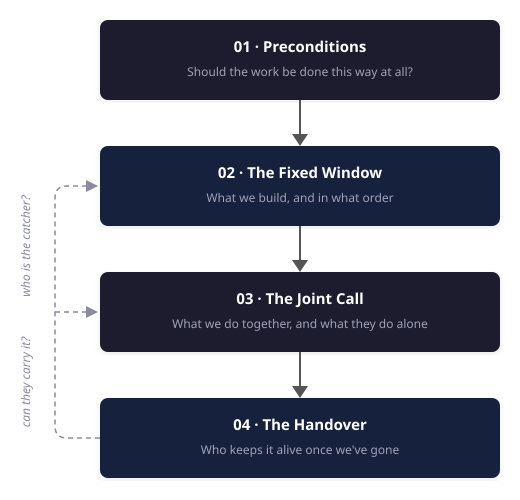

{fig-alt="An engineer arriving through a doorway into a busy workplace, with a clock above the entrance."}

Most of what's written about forward deployed engineering is about the job title — whether it means anything, what skills are needed, or if it's consulting with better branding. My aim is to describe forward deployed engineering from the inside: what the work actually involves, rather than who deserves the title.

The conditions that make this work different from anything else I've done are easy enough to articulate:

- We are building inside an organisation that isn't ours, with the customer's data, under their constraints, alongside their people.
- We are accountable for the thing working in their environment rather than in a demo.
- We are up against the clock — when the engagement ends we leave, and what we built either keeps running without us or quietly stops mattering.

Everything that follows derives from this context.

I've written before, in [Hypothesis-Driven AI Delivery](TODO-HDD-URL), about how I frame this type of work before it starts: getting clear on the
outcome, making the unknowns explicit, validating the critical ones before committing to build. That covers how to frame and validate the solution. This is about what happens once an engagement begins. It comes down to four questions.

**Should the work be done this way at all?** Forward deployed engineering has preconditions, and where they are absent, the critics who label it expensive consulting are right. Naming those conditions lets us decide when this model fits and when something else would serve better.

**What do we build, and in what order?** The time pressure creates a strong instinct to start coding
immediately. In my experience, that instinct is usually wrong. The highest-leverage early work is often understanding and instrumenting the existing process rather than building the proposed solution.

**How does a joint team decide what to spend the engagement window on?** The window rarely stretches to everything. What
comes off the list, who decides, and what happens to the work that doesn't make it.

**Who owns the outcome, and who keeps the system alive once we've gone?** Those are different questions, and failing to answer the second is what decides whether the work will still be providing value years later.

The through-line is that the hardest parts are rarely the most technical ones. That surprised me when
I started doing this kind of work.

This is written for people building, leading, or commissioning embedded engineering work, whether or
not they use the forward deployed title for it.

The four questions form one narrative, in roughly the order they arise during an engagement.

## 01 · Preconditions

*When outcome-led delivery works, when it doesn't, and why most of the argument about it is beside the point*

{fig-alt="A figure at a crossroads of several lit paths, consulting a checklist before taking the one marked out ahead."}

I look for three conditions: a requirement framed around an outcome rather than a prescribed solution, a named owner inside the organisation, and enough existing platform and tooling to make the bespoke work affordable.

### The requirements are descriptive, not prescriptive

Most delivery runs on prescriptive requirements. FDE runs on descriptive ones.

Prescriptive is scoped implementation — usually contracted time and materials, sometimes fixed price. The customer knows what they want built, the requirements are defined up front, the scope is agreed before anyone starts, and success is delivering that scope on time. There is nothing wrong with this. It is the right model for an enormous amount of valuable work, and the people who are good at it are genuinely good at it.

I think of descriptive as starting from a business outcome, agreeing how we'll measure whether it moved, and working out the implementation together. Success isn't that four things were delivered. It's whether the outcome moved.

The short version: scoped implementation is *build this thing for us*. The aspiration of forward deployed engineering is *help us achieve this outcome by building it with us, and leave us more capable than you found us*.

The distinction has a commercial shape as well as a philosophical one, which can be easy to conflate. In its clearest form, scoped implementation fixes what gets built and allows time and cost to move around it. What we are discussing inverts that: fixed capacity, fixed duration, variable scope. We agree how many people for how long, and what they work on is governed by a backlog prioritised jointly and revised as we learn from the engagement. It ends when the capacity is spent or the term expires, whichever comes first — not when a list is finished.

A strong indicator is to **ask who owns the outcome once we've gone, and whether that answer already exists.** If there is no named person inside the customer's organisation accountable for the result and involved while the work is happening, this isn't a forward deployed engagement, regardless of how the contract describes it. This doesn't settle who maintains the thing afterwards — a separate question, and one I'll come back to. But somebody on their side must remain accountable for acting on what the engagement establishes. If nobody is, we were contractors with a better title.

I've redirected work on exactly this basis. One anonymised request makes the distinction concrete.

We were asked to deploy a particular platform and demonstrate its value against a set of use cases the customer had already chosen. The solution had been chosen before the conversation started, so had the use cases; which left no discovery to do. The question was whether they could get value from the platform. That is a question about the platform, not a question about their business.

Plenty of what we do exists to enable a decision; de-risking an unknown so that somebody can commit or walk away is often the most valuable work available, and it justifies a team readily. However, those engagements are pointed at a business outcome, and the decision they unlock is a decision about that outcome. This one had no agreed business outcome beyond a list of areas where value might exist. **A list of places value might be is not a business case** — and without one, there was no way to judge whether what we found would justify the team it would take to find it.

That last part matters more than it sounds, and I'll come back to it. Capacity for this kind of work is scarce and expensive. Every engagement taken on a maybe is one not spent somewhere the value is legible.

It's also the public complaint running backwards. Everyone worries about sales engineers being relabelled as forward deployed engineers. Here, the confusion ran the other way: a forward deployed engineering team was being pointed at a platform-validation objective rather than a customer outcome. Both are legitimate forms of technical work. They are simply different engagement shapes, and everyone working across them has to navigate the boundary.

There's another version of this argument worth discussing that reaches a different conclusion: AI has collapsed the cost of writing code, so the scarce thing on the front line is no longer the person who can implement but the person who can tell you what is worth implementing — therefore what you actually want is a consultant who prototypes, not an engineer. I agree with the diagnosis completely. Problem clarity is a bottleneck, and it always was.

Where I disagree is the conclusion, because the person deciding what is worth building has to be accountable for what happens when it meets production: the data that turns out not to be what anyone said it was, the constraint nobody mentioned, the evaluation that comes back and says the approach doesn't work. Separate those two roles and you get the thing the industry already has far too much of — confident scoping, an impressive prototype, and nothing that survives contact with a real system.

### What we actually commit to

Here's where I have to be honest about a tension in my own position.

What we commit is capacity and duration. What we steer by is the outcome. Those are not the same thing, and customers hear the second one louder, especially when FDE is positioned as outcome-led.

If you tell a customer that the engagement will be judged on whether a business metric moves, it is entirely reasonable for them to hear a commitment that the metric *will* move. What's actually on offer is a fixed team for a fixed period, pointed at that outcome, with the scope adjusted along the way and an honest account at the end of how far it got and what it would take to finish. Those are different promises, and the gap between them is where expectations go wrong.

There is a stronger answer than repeating the caveat, and it sits between the two promises. The outcome is lagging: it often lands after we've gone and depends on more than us, which is why it can't be the commitment. But its leading indicators can be. The things the joint team controls and produces inside the window — the baseline measured, the evaluation gate operating, the system carrying real traffic at an agreed stage, their engineers shipping changes without us — are chosen because they are the best available drivers of the outcome, and each one should have a defensible line to it. These don't need to be contractual to matter. Especially with customers who haven't worked with us before, naming them with targets is how we put skin in the game, and like everything else they're revisited with the customer as the engagement teaches us more. The lagging outcome's job is to keep the leading measures honest, not to become a penalty on a team for results it doesn't control.

Even with all of that stated at the beginning, it can still be misheard: what an engagement commits to and what a sponsor promises internally can become two different narratives. It shows up most sharply when our engagement is one slice of a larger product or programme. We are accountable for the slice; the outcome that actually matters depends on the whole. Those two get conflated easily, and almost never on purpose — which is why being explicit about where the boundary sits, early and repeatedly, is a real part of the job rather than an administrative chore.

So the fix isn't a clever form of words. It's to keep saying it: the outcome is what we're aiming at and what we'll measure against, the leading measures are what we're driving while we're in the room, the capacity and the window are what we're actually committing, and we'll be straight about the distance travelled. Most of the trouble I've seen comes from saying it once, at the start, and treating that as done.

### Somebody has to own the outcome

This condition is narrower than it sounds, and it is not negotiable. There must be a person inside the customer's organisation who is accountable for the outcome and involved while the work is happening. Not just a sponsor who receives updates — someone whose result this is. That role cannot be delegated outward: a vendor cannot own your outcome, and a product certainly can't.

This is a different question from who maintains and evolves the system afterwards, which may have several legitimate answers — their own team, a partner, or something they buy — each implying a different way of structuring the engagement. The owner, though, is the part that has to be true before anything starts. If there is nobody accountable on their side, the engagement will produce something impressive that decays quietly. I've done that. It's a worse outcome than not starting.

### There has to be something to build on

This is the condition that decides whether the economics work, and the one I see discussed least.

You cannot put something real into production inside a short window while building everything from scratch. What makes the bespoke layer affordable is everything underneath it that you didn't have to build: managed model platforms, data platforms, tooling, hosting, orchestration. That substrate is the reason a small team can do this at all.

There's an optional, but powerful, second layer on top of that — the patterns and scaffolding your own team accumulates across engagements. That work rarely looks like the interesting part, but it can be the difference between solving a problem once and being able to solve it repeatedly.

Every viable version of this model I've seen has that substrate. You either build it — an enormous, sustained investment that almost nobody can now justify per customer — or you stand on someone else's. What changed over the last few years is that standing on someone else's became genuinely viable, and I think that's a large part of why this model has spread as fast as it has.

It also explains the fragility. A team adopting the title with neither layer is starting bespoke delivery from zero on every engagement. Without reusable foundations or accumulated accelerators, the model loses the leverage that makes a short embedded engagement economically coherent. Changing the title does not change those economics. When critics say this is consulting with a new name, that is the case they are describing — and for those teams, they are right.

### What it costs

This is an expensive way to work, wherever it's practised. Senior people, embedded for months, on one problem at a time.

In my experience it is also a hard profile to hire for. The work asks one person to scope an ambiguous problem, build the thing properly, hold their own in a room of stakeholders (some of whom perhaps did not ask for them), and then hand it over and leave. People who are credible across all these dimensions, and who want to work this way, take a long time to find and longer to grow.

So the work has to be pointed at problems where the value plainly justifies it — mission-critical objectives with executive sponsorship, a measurable outcome, and an owner on the customer side who actually wants it.

The public framing is that forward deployed engineering is definitionally an upmarket motion. I'd put it differently: it's costly and scarce, so it ends up upmarket. The distinction matters, because the first version makes it sound like a sales strategy and the second makes it a rationing problem — which is what it actually is, and which is why the qualification discipline matters. Every engagement taken that another model would have served better is capacity that can't be spent where this one counts.

### Why I do it anyway

This is the most interesting work I've done. You end up deep inside somebody else's domain — how a manufacturer decides a part is defective, how a stylist thinks about what goes with what, what a support engineer actually knows that has never been written down anywhere. You have to understand it well enough to collaborate with people who do it for a living. That's a real privilege, and it's the part I'd miss most.

The title argument will resolve itself, probably by the term losing its edges the way these terms do. The conditions won't change. Descriptive requirements, somebody who owns the outcome, something to build on — get those three right and the label doesn't matter much. Get them wrong and no amount of naming will help.

Suppose we have established that FDE is a good fit. The requirement is descriptive rather than prescribed, somebody inside
the organisation is accountable for the outcome, and there's something to build on. You've
agreed a window, and it has a date on the end of it.

Now what do you actually do with it?

## 02 · The Fixed Window

*You have a fixed window inside someone else's organisation. Everything else follows from that.*

{fig-alt="Two engineers working side by side on a factory floor beneath a large countdown clock."}

The clock creates one strong instinct: start building immediately. Time is short, the sponsor is watching, and code — now cheap to generate — is the easiest output to mistake for progress. I've followed that instinct and watched other people follow it, and I now believe it is usually wrong. Inside a fixed window, the highest-leverage early work is often understanding how the customer's work is done today, and instrumenting what the existing process fails to record, rather than building the proposed solution.

### Capture the work before you change it

The first stage of an AI project usually shouldn't focus on the AI.

#### Make the existing work legible

I like to start with what the current process doesn't record. On one engagement, a customer wanted to automate the production of extensive technical documentation. They had years of finished documents and a clear picture of the end state. What they didn't have anywhere was *why* any particular decision had been made. The reasoning had never been written down, because no human process required writing it down. The same information gap appears in support work. Ticketing systems record the problem and the eventual resolution, but rarely the reasoning or tacit knowledge an expert used to get from one to the other. That missing knowledge is precisely what the team needs to capture.

You cannot generate from a signal nobody recorded. So the first move is to instrument the existing process to start capturing it.

The second thing often missing is the baseline. Ask what the current process costs — time spent, corrections made, mistakes caught downstream — and, in many organisations I've worked with, it hasn't been measured. Everyone believes it's expensive; nobody can say how expensive. This is the best moment to create that comparison, before the intervention changes the process itself. If the team discovers too late that it cannot prove improvement, there may no longer be a credible baseline to recover.

The third is how experts actually solve the problem, rather than how they describe solving it. Interviews reveal the rules they can articulate. Capturing traces of them working real cases start to finish reveals the ones they can't — the exceptions, the shortcuts, the judgement calls that never made it into a procedure document.

In this type of work, traces of the existing process are often among the most valuable early artefacts the team produces. A well-designed capture exercise turns tacit knowledge into inputs the system can use: hard constraints to enforce in code, repeatable patterns to encode in workflows and evaluations, and reasoning to provide to an agent when a decision still requires judgement. The same traces can supply examples for the evaluation set and evidence to compare against the baseline. Without them, the team risks spending the rest of a short engagement arguing from opinion.

#### Design capture people can sustain

The technical work here is often more straightforward than the organisational change it requires, and that is the trap. We aren't automating a process yet — we're making it legible first, and to do that we are asking people to add steps to their day for a benefit that arrives later.

Whether the capture works has less to do with seniority or technical sophistication than with who benefits from it, and whether the people doing the work have any slack.

Let's start with who bears the cost and who receives the benefit. Where the person doing the extra capture is the same person whose day gets easier — someone helping to automate the part of their own job they never enjoyed — it largely sells itself. Where the cost lands on one person and the benefit lands on someone else's numbers, the engagement is asking for a favour, and it usually goes better when we treat it as one.

The other constraint is whether they have any slack. Some people control their own working pattern and can absorb an extra step, choosing when to pay for it. Others are working to a measured quota, where every added action comes out of something they are held to. That isn't reluctance. It's arithmetic, and no amount of explaining the long-term benefit will change it.

So where the benefit lands with the person doing the work, involve them properly: the end state, the experience, what it looks like when it works. Where it doesn't, relying on enthusiasm is a mistake; the capture needs to be a by-product of work they already do rather than an extra task. In my experience, a capture that misses some cases but is still running in month three does far more good than a complete design that people quietly stopped following in week two.

#### Separate rules from judgement

The next step is to work out how much of the problem doesn't need a model at all. Reading how experts resolved a hundred real cases surfaces constraints nobody thought to mention in a workshop, because to them they were too obvious to say out loud — and most of those belong in code, not in a prompt. Wherever a deterministic process can be extracted, extract it: it's more reliable, easier to explain, and easier for someone else to change after the original team has gone. The model proposes; deterministic checks dispose.

### Measure against existing performance, not perfection

I have this conversation on many classification or detection projects.

The stakeholder wants to know when it will be right every time. Not in those words, but that's the bar being described, and underneath it is an assumption that the process being replaced is currently correct. It isn't. The people doing this work make mistakes too, they make different mistakes on different days, and in many organisations I've worked with that error rate hasn't been measured.

Existing performance, not perfection, is the comparator the system should be measured against.

The most effective way I've made this land wasn't an argument. On a manufacturing engagement, our model was catching defects that human inspection had missed, but its false-positive rate was still too high to ship. In a leadership session, I showed the room a set of unlabelled images and asked them to identify the defects. They couldn't reliably do it from the images alone.

That did not prove the model was matching the inspectors. The inspectors could handle the physical items and draw on information the model never received. The exercise exposed an input gap: we were asking the model to reproduce a judgement while giving it less evidence than the existing process used.

Existing performance is only a useful comparator when the differences in available information are explicit. And comparator is still not the same as bar. Even matching human performance does not automatically mean a system is ready. Automation changes the scale at which a mistake happens, some errors cost far more in one direction than the other, and in a regulated setting the acceptable rate may not be ours to negotiate. On that manufacturing line, false positives remained the blocker because a false alarm and a missed defect were not equivalent events.

What the comparator does is stop the conversation being unanswerable. It replaces "when will it be right?" with "how does this compare to what happens today, and where does it need to be better?" — and on a clock that matters, because perfection is not a useful target for a fixed window. A project implicitly targeting it can end with a system that works and a sponsor who still won't sign it off.

This is the same distinction I make in evaluation more broadly: a score is evidence, not a verdict. The comparator tells us how the system performs relative to today; the readiness bar tells us whether that evidence is strong enough to act on.

Before the team leaves, the readiness bar has to become a release rule the receiving organisation can operate. The traces captured earlier become the evaluation set, and the outcome owner and subject-matter experts identify which scenarios matter most. A regression in one of those scenarios blocks the release even if the overall score improves. The same evaluation should run before release and against production traffic, so "ready" means the same thing before and after deployment.

My standard is blunt: if it can't stop a release, it's a dashboard, not a gate.

### Let autonomy follow the evidence

The usual advice is to phase autonomy carefully — advise first, then act with approval, then act with oversight — and it's usually justified as caution. Build confidence slowly, don't spook the users.

The stronger reason is that each stage produces the evidence the next stage requires, and that engine needs to be running before the team leaves.

Bring the system in alongside the person. It recommends, or it drafts and the person corrects. What they accept, what they reject, and above all *why* they rejected it, is a stream of labelled judgement that is otherwise extremely difficult to obtain. Too often, teams log it without feeding it back into evaluation. Use it properly and whole slices of the problem start being handled well; the person moves from doing the work to reviewing it, and eventually to sampling. It's the same progression we've used for data labelling — all human, then correcting model output, then reviewing only the high-risk cases.

The team cannot skip straight to the final stage. Trust is part of the reason, but evidence is the stronger one: the last stage is only justifiable on evidence the earlier ones produce. Not every part of the system needs to reach full autonomy; some actions should remain approval-bound. The point is that any increase should be justified by evidence produced at the previous stage. A system the receiving organisation cannot evaluate or improve has a short remaining life, even if it keeps running.

### Make progress legible before anything looks finished

All of this happens during the stretch where there's very little to show. The capture phase produces no demo. The evaluation set is invisible to anyone outside the team. The ramp moves slowly by design. That's when sponsor confidence erodes, and it erodes fastest when people feel surprised.

So show the ramp rather than the roadmap. What the system recommended, what happened, where a person overrode it and why. That beats a percentage complete, because it's evidence rather than assertion, and it gives everyone a real basis for deciding together when to move to the next stage. The same artefacts that make the system trustworthy also make progress legible. That matters inside a short window: the team cannot afford a separate layer of reporting disconnected from the evidence.

I've had senior engineers doing this work tell me they didn't feel productive because they weren't writing much code. I understand the instinct. For much of our careers, code was the clearest evidence that engineering was moving.

In a forward deployed engagement, making the work legible, establishing the comparator, and building the evidence needed for release can look like overhead around the engineering; in practice they determine whether the implementation matters at all.

AI agents make this more important, not less. As code becomes cheaper to produce, more of the value moves into deciding what to build, capturing the knowledge it depends on, and establishing whether it is ready to be relied on.

That gap is the job. Not the title — the constraint: a fixed window, someone else's organisation, and a system that has to outlive the team that built it.

All of that is about the system: what to capture, what to measure it against, and how to let autonomy
follow the evidence. It is also, deliberately, half the picture. None of it happens in a
vacuum. It happens inside an organisation with its own people, its own politics and its own view of
why you are there — and against a window that will not stretch to everything on the list.

## 03 · The Joint Call

*How two teams with one deadline decide what to build together — and what happens to everything else*

{fig-alt="A joint team gathered around a shared board of backlog columns, one person moving an item."}

What separates forward deployed engineering from scoped implementation is that the work cannot be fully specified or directed by either side alone. The customer owns the outcome and the business priorities; the joint team works out how to pursue them as evidence emerges.

In the engagements I've led, that has meant working from one shared backlog. I recommend it, but the backlog is the mechanism rather than the principle. The principle is shared control of the route, with clear ownership of the outcome.

But that is not where the relationship starts.

### You don't arrive in a neutral room

This is the part of the work I was least prepared for.

The room is not always neutral when we arrive. How people interpret us depends on what happened before we got there and what they have learned to expect from outsiders. Their previous experience with consultants or sales engineers, their relationship with the account team, and whether they asked for our involvement all shape whether they see useful help or overhead imposed by management.

A team may have hit a real limit — such as an attempt that didn't work, or a proof of concept they couldn't take further — and our arrival makes that visible. In other cases, the team is perfectly capable but their leadership listens more readily when the same answer comes from an outsider. A stakeholder may see us as competition because we've entered territory they consider theirs without being invited. Others assume we're there partly to create future work. Often, we are. The important question is whether the current engagement is being shaped around their outcome or around what we hope to sell next.

None of those reactions is irrational; treating them as obstruction is the fastest way to make them permanent.

On one engagement, we understood the work to be greenfield. Nothing in our discussions with leadership suggested that an existing team was already working in the same area. We developed an approach on that basis, presented it to the leadership team, and it began to gather momentum.

When we asked for people to co-engineer with, leadership introduced us to the lead of a team whose work overlapped substantially with what we were proposing. From their perspective, an external team had designed a competing approach and generated executive enthusiasm before involving them. Their concern was entirely reasonable.

When we looked closely at what their team had built, much of it was sensible. There were gaps, particularly around evaluation, where our experience could add value. So we stopped treating the work as greenfield. We made clear to leadership what the existing team had already got right, and focused our contribution on the areas that were missing.

The relationship changed once it became clear that we were there to build on their work rather than replace it. The person who had challenged the approach became one of its advocates.

None of this is in the job description, but it takes a meaningful share of a short window. Before delivery can operate as one team, both sides need a shared understanding of what commitment looks like and who owns which decisions.

### Commitment isn't measured in engineers

I have seen customer engineers treated as a proxy for commitment: if the customer cannot assign engineers, the organisation must not be serious. I don't think that follows. Sometimes they simply do not have the specialist profiles the work requires; this matters when deciding who will maintain the system after we leave, but it is a different question from whether they are committed to the engagement.

During the work, the most valuable customer contribution is often deep knowledge of the business and domain: how the process really operates, what has already been attempted, where decisions become blocked, which constraints are fixed, and who can move the ones that are not. Customer engineers are valuable when they bring that knowledge or will eventually own the system. They are not the only evidence of commitment.

Some of the hardest engagements I've seen had customer engineers assigned but lacked alignment between the executive sponsor and the engineering lead. The sponsor was working towards a longer-term strategic vision, while the engineering team was accountable for immediate operational priorities. Neither perspective was wrong, but without an explicit decision about how to balance them, the forward deployed team was left trying to resolve a trade-off it did not own.

What a joint team does require is deep knowledge of the business, clear ownership of the outcome, and agreement about who makes which decisions.

### One team, one backlog

Once both sides are genuinely working together, prioritisation stops being something we present and becomes something we do together.

There is one backlog and it doesn't belong to us. It starts as the output of framing the work — the objectives, the assumptions, and above all the hypotheses and unknowns identified before anyone committed to build. That list isn't filed once delivery starts; it becomes the backlog, and it evolves as evidence emerges — assumptions fail, hidden constraints surface, and parts of the problem prove harder or easier than expected.

Joint ownership changes how priorities move. A shared backlog can be reprioritised in a conversation; a supplier-owned backlog has to be renegotiated. For a fixed-capacity, fixed-duration engagement, the backlog is the governing mechanism: it decides what the capacity gets spent on, and prioritising it together is how the engagement is steered.

The backlog is shared and worked through together. Routine priority calls usually sit with the customer's product owner. When priorities reflect a deeper conflict between immediate delivery needs and the longer-term outcome, the accountable sponsor has to break the tie. That makes rescoping something the customer has a stake in rather than something done to them.

The backlog makes those choices and their reasoning visible; the sponsor keeps them aligned to the outcome and unblocks the organisation. The joint team still owns technical judgement and what it can responsibly deliver. It should not be left to resolve business disagreements on the customer's behalf.

### The steering committee is not a status meeting

The shared backlog handles day-to-day prioritisation. But the stronger indicator of long-term success is an engaged executive sponsor: someone invested in the outcome, able to unblock the team, and senior enough to make things happen across the organisation.

The steering committee is where that sponsorship becomes active. It shouldn't be a status report, but a working session: what the team is doing now, what is blocked, what's next, and where the sponsor needs to change the order or break a tie.

As evidence emerges, the work competing for the fixed timeline changes. New priorities appear, some items take longer than expected, and others stop mattering. If the team and sponsor share the same view, they can decide what to continue, add, defer, hand back or drop.

Shared context does not make those conversations easy. I've been in sessions where the update was that the data couldn't support what everyone had been promised, and nothing made that comfortable. What the context does is keep the conversation focused on what to do next, rather than on why nobody saw it coming.

The decisions made in this forum must flow back into the shared backlog. Otherwise the steering committee and the delivery team are working from different versions of the plan.

### Treat descoping as an allocation decision

When we are augmenting an existing team that can carry the work, taking something out of our scope does not necessarily remove it from theirs. It often means they'll do it without us.

That changes the scoping question. It is no longer simply "what gets done?" It becomes **"what do we do together, and what do they do alone?"**

Descoping becomes an allocation decision. If the customer team feels less confident tackling something after we leave, that is where the joint time should go. Work they can comfortably do alone should stay with them — not as a concession, but because spending scarce, shared time on it wastes the capacity that made the collaboration valuable.

How the decision is framed changes the conversation. "We're cutting this" frames the decision as a loss. "Your team are confident in delivering this part, so let's focus the remaining time where our involvement adds more value" frames it as an allocation of scarce joint capacity. That is both more accurate and easier to act on.

I saw this clearly on an automated call centre build, where the ambition was to get customer journeys into production: take one end to end, then scale out and demonstrate the system handling several.

Partway in, it became clear that actually productionising that first journey was far harder than anyone had estimated, and not for technical reasons. Getting anything into production meant approvals, resources provisioned in particular ways, and a considerable amount of documentation. All reasonable, but slow. We could have spent the rest of the engagement on it — and finished with one journey live and no evidence whatsoever about whether the thing could scale.

The customer's first response was to ask whether we could extend. We'd have liked to, but we couldn't — my team was already committed elsewhere. The fixed window constrained us too, so we had to decide where our remaining time was uniquely valuable, which required a conversation about what the customer team could carry on their own.

The uncertain question was whether the system could support multiple journeys. If it couldn't, there was little value in productionising the first one. The customer team already knew how to navigate their own governance, even if it was slow, and it was something that team had done many times.

We handed the production work back to them and used the remaining time to prove how the system could support several journeys — which we achieved.

We answered the question that could have killed the whole approach, while there was still time to act on the answer. However, this meant handing back the most visible part of the original ambition and protecting the less visible technical risk. It felt backwards, but it was the better use of the time we had.

Some work simply fell away. We had wanted to be there when the first real traffic arrived, so we could refine monitoring and observability against live data. We didn't get a chance to provide any input into this. It was a straightforward cost of a window that wasn't big enough.

The customer continued the deployment after we left, and I believe they completed it, but I don't know for certain. Once work is handed back, you give up the right to watch how it ends.

This only works when the customer team can genuinely complete the work handed back to them. If the gap is not temporary experience but a capability the organisation does not have, "they'll pick it up" is not reallocation. It is cancellation deferred until after we leave.

That assessment has to happen *before* the descoping conversation. Otherwise nothing has actually been reallocated — the list is just shorter, and the gap in it gets discovered after we've gone.

### Make the collision explicit

Two things survive almost any reprioritisation.

The first is the critical unknowns. Whatever the work depends on being true, and isn't yet known to be true, is the first thing I protect and the last thing I'd descope — getting maximum clarity early is what makes every subsequent decision easier for the whole team. That's the same discipline that governs how the work is framed in the first place, applied to time rather than to uncertainty: find out what you don't know first, because everything else is contingent on it.

The second is whatever the sponsor genuinely has to achieve. Prioritisation isn't purely technical, and an executive who needs a particular thing to land by a particular date isn't interfering — they're supplying a constraint you needed to know about.

Sometimes those priorities collide: the window cannot hold both the unknown everything depends on and the commitment the sponsor has already made.

This is the kind of decision the steering committee exists to surface. Resolving it inside the delivery team would mean making a judgement about someone else's business. Often the conflict changes once it is in the open: the sponsor's commitment reframes the critical unknown, and the team realises it was protecting the wrong question. When it does not, the accountable outcome owner has to decide between what the business needs and what the evidence can currently support.

I've seen that run to its extreme. On one engagement we built the datasets, the training and evaluation pipelines, and ran the experiments — but the results came back far below anything we'd expected. Error analysis pointed upstream, at the source data rather than the modelling. Everything remaining went into that: characterising the problem, hand-curating clean subsets to get an honest estimate of what was achievable at all, separating what could be mitigated after the fact from what would have to be collected again. Almost nothing we'd planned to build got built.

Those sessions were hard. Telling a customer that the current data cannot support what they planned to build, and that the reason sits upstream of anything you were brought in to do, is not made pleasant by anybody sharing context.

This was descoping at the largest scale: the entire original plan was deferred to an unknown future milestone. We agreed the prerequisites together, the customer worked towards them, and once they were met we returned and ran the engagement we had originally expected. The plan still happened; it just could not happen yet.

### Choose breadth or depth deliberately

The trade-off is often how broadly to explore the problem and how deep to take each part. Sometimes it is worth testing several areas just far enough to learn where the real difficulty lies. In other cases, a partial answer is useless and one question needs to be resolved properly before anyone can act.

I don't have a general rule for how to approach this; it depends on the decision the sponsor needs to make, where the value is concentrated, and what the customer team can carry forward after we leave. What matters is making the choice deliberately and early enough to affect the work, rather than discovering at the end what kind of answer the engagement produced.

### Why this is the part I'd miss

The part I didn't expect, when I started doing this kind of work, is how much of the satisfaction is in the people rather than the systems. You arrive somewhere you aren't entirely welcome, among people with good reasons to be wary of you. Some of the most satisfying engagements are the ones where someone who was initially unconvinced eventually becomes an advocate for the work. Then we leave, because that was always the point, and the work continues without us.

The best ending is not the system we built. It is leaving behind a team that no longer needs us.

Deciding what to hand back rests on two judgements I have so far assumed you can make: who will
maintain and evolve the system after you leave, and what they can genuinely carry. Those questions are
harder than they sound, and getting them wrong is expensive in ways that become visible only later.

## 04 · The Handover

*Delivery capacity gets the plan. Ownership capacity decides whether it lasts.*

{fig-alt="A departing engineer handing a glowing, intricate object into another person's open hands."}

The project was an executive priority. The customer's team had built a proof of concept that wasn't performing, and we were brought in to fix it. We looked at it, concluded the foundations wouldn't carry what they wanted, and rebuilt from the ground up.

We deliberately built the system in a modular way so they could own parts of it, but found that their contributions still required substantial refactoring from our engineers.

We read that as a coaching problem. It was a reasonable read — I've seen plenty of teams struggle to get from zero to one and then iterate perfectly well once the structure exists, and it's one of the more satisfying things to watch happen.

Months later the sponsor got close enough to the work to see how much effort it was taking. They concluded it was beyond the team they had, and bought a third-party product instead.

In one sense our work produced a genuine and useful realisation. However, everyone was still disappointed — not with the outcome, but with how long it took to reach it. We could have got there in a fraction of the time.

### Why we discovered it too late

We built the system in modules *specifically* so the customer's team could contribute. What modularity then permitted was both teams working in parallel on different components, and we never really worked on the same modules they did. Nobody reviewed across the seam. So the read on whether they could actually own this system was deferred until we integrated and compared overall system performance against the product goals — at which point we were heavily invested.

The structure we designed to enable the handover is what concealed that the handover wasn't going to work.

The sponsor had agreed that the existing team would maintain and evolve the system and talked about building out that team in future, but the organisation was already struggling to hire similar profiles elsewhere in the business. We had also seen engagements where another internal team or external partner took over once the value was proven. Together, those possibilities gave us enough reassurance to let the transition question ride.

That reassurance was misplaced. The existing team had been named as the catcher, but there was no executable plan for getting them there. Nobody had agreed which capabilities needed to be added, when they would exist, how the system would be supported while the team developed them, or what would happen if the hiring did not materialise. By the time that gap became undeniable, buying a product was the only practical option left.

### Separate delivery capacity from ownership capacity

Organisations bring in specialists for all sorts of reasons. Sometimes it's a gap in specific experience, but at least as often it's capacity, urgency, or the fact that the people who could do it are already committed to other things that the business cares about; assuming we were called because they aren't good enough is often wrong and always a bad way to start.

There are two different capacity questions:

* What the joint team can deliver during the engagement.
* What the receiving organisation can maintain and evolve once the specialists have gone.
  
Executive ambition can exceed both. 

In my experience, the first receives far more attention because it shapes the immediate delivery plan. The second is easier to defer, even though it determines whether the work can be sustained after we leave.

In forward deployed work, we leave on a fixed date; we are not the long-term owner. A system that only our team can run is not a deliverable — it's a liability with a delay on it.

#### Outcome accountability and system maintenance are different responsibilities

Someone inside the customer's organisation must be accountable for the outcome. That isn't transferable — a partner can't hold it and a purchased product certainly can't. But the long-term operating model has three legitimate shapes: their own team maintains a bespoke system, a partner maintains it, or they choose a product maintained by its vendor instead. Each implies something different to build.

I use *catcher* as shorthand for whoever will maintain and evolve the system after the forward deployed team leaves. Naming the catcher is a design decision, separate from naming the person accountable for the outcome.

Any of the three models can work. The problem is reaching the end of the engagement without having chosen one.

### Sophistication is not the mistake

On one engagement we built a full training, evaluation and deployment pipeline for a neural network and industrialised it to the point where the customer's team could run everything they needed by pushing a few buttons. It ran in production for years without incident.

They were never staffed to iterate on it. They emailed us to ask questions and to point out minor issues, and eventually the company brought in a partner to maintain and extend it — which turned out to be exactly the right answer.

For a long time I saw this as a handover failure: we had built something the team could operate but not evolve. That was the wrong diagnosis. The team was not left less capable than we found them; if anything, the opposite. We hadn't over-built either. Given what their leadership wanted the system to do, there was no meaningfully simpler version. The work required profiles their organisation did not have and had not hired for.

Working side by side with specialists can, and usually does, leave a customer team more capable. That is part of the point of the model, but it works within the range of the roles and foundations already present. We can help people extend their skills, adopt new practices and grow into unfamiliar work during an engagement. We cannot turn a database administrator into a data scientist in twelve weeks. When the work requires profiles the organisation does not have, the answer may be retraining, hiring or restructuring, but that happens on a different timescale and belongs to their leadership rather than the delivery team.

It turned out alright. Bringing in a partner was the right outcome. But the mismatch had been visible early, and I treated it as something we'd work through because I avoided putting a difficult question in front of the steering committee: was there a credible path for the existing team to maintain and evolve what we were building? That was exactly the kind of decision the forum existed to surface.

### Prefer simplicity when complexity buys nothing

In other cases, the simpler option is the better one, and sometimes my job is talking customers down from the state-of-the-art approach they've read about towards the boring thing that works.

On one project, the customer wanted a small custom transformer after reading a paper. We read the same paper and implemented it. Then we tested a gradient-boosted tree alongside it, deliberately, because I wanted the comparison rather than the argument. The transformer won — narrowly, by a margin that made no difference to the decision the system was actually supporting, and only when the comparison ignored training time, cost and everything involved in maintaining it. We shipped the simpler model, then distilled it further into a decision tree.

We already had reason to test a simpler approach. Talking to the subject-matter experts confirmed that this was a classification an expert could make reliably. One of the strongest indicators I use when judging whether a project is feasible at all is whether a human expert could do it with the data available. Here, that indicator pointed at a different question: how much complexity did the solution really need? It was not proof that a simpler model would be good enough, but it was enough reason to test one before committing to more.

Choosing the simpler model was not a compromise. Its small performance disadvantage made no difference to the decision the system supported, while a model the customer's team could read, reason about and change themselves was worth more after we left. Where additional performance genuinely matters, the more complex system may still be the right choice — but only with an explicit maintenance plan.

### Name the catcher before you build

**Settle the maintenance model explicitly with the sponsor** — separately from naming who owns the outcome, which should already be settled. Their team, a partner, or a vendor-maintained product, and then design to it. A button-push industrialised system is *correct* if a partner is catching it and a failure if we assumed the customer team would iterate. The build follows the answer, so the answer can't be discovered at the end.

**Test the ownership assumption while there is still time to change the plan.** If the receiving team is expected to maintain the system, avoid dividing the work so cleanly that their ability to do so only becomes visible at integration. Working on the same components and reviewing each other's contributions costs some speed, but it provides an early signal of whether the planned handover is credible.

That signal is only useful when the team contributing during the engagement is also expected to maintain the system; often it is not. We may spend months alongside the product team and subject-matter experts, only for the system to land with an operations group, systems integrator or partner who was in none of those rooms. In that case, the contributing team tells us little about whether the planned handover is credible.

When the catcher is elsewhere, involve them early. Ask who will support the system in a year, spend time with them, and look at what they already run. That is the best available evidence of what they can realistically take on.

We wanted to build the best version of the system, but a fixed departure date changes what "best" means. The question is not only what we can build, but what the customer can sustain after we leave.

## What it adds up to

Four questions, and they are not independent. They compress into a handful of decisions.

Take work framed as an outcome rather than a
specification. Spend the early part of the window making the existing work legible instead of
building, because what you capture there pays for the rules that belong in code, the evaluation set,
the baseline you'll be judged against, and the evidence the receiving organisation needs to evaluate
and improve the system after you've gone. Compare the system with existing performance, then turn the
readiness bar into a release rule the receiving organisation can operate. Let any increase in autonomy
follow the evidence, accepting that some actions should remain approval-bound. Decide out loud,
together, what the window will hold.

That isn't a playbook you can apply mechanically, and I'd be wary of anyone selling it as one. It's a
sequence of decisions that keeps arriving in the same order, and a set of mistakes I've made often
enough to recognise on the way in.

What ties it together is the thing I understood last. The window is what you have. What you're
spending it on isn't the system — the system is the visible part. You're spending it on the distance
between a thing that works and an organisation that relies on it.

Those are two different achievements, and nearly everything above exists to close the gap between
them. The captured traces and the evaluation set are how anybody knows the thing works at all. The
comparator is what makes *is it ready* an answerable question instead of an argument. The autonomy
of the system is earned in stages through evidence rather than granted on a demo. Deep domain knowledge
keeps the work grounded in how the organisation actually operates. The shared backlog makes priorities
and trade-offs visible. An engaged sponsor unblocks the organisation, resolves the business decisions
the delivery team does not own, and uses the steering committee to surface difficult questions while
there is still time to act. And the handover question is simply whether that reliance survives your
leaving.

None of which is soft. Trust here isn't a feeling somebody extends to you. It's a judgement other
people reach from evidence accumulated together over months and tested in practice. It is also what
decides whether the thing you built gets used, and it is the part no amount of technical progress has
made any easier.

The technology will keep getting cheaper and faster. That hasn't been the hard part for a while. A
working system can be delivered inside the window. The harder achievement — an organisation that
relies on it — has to continue after you've gone.

---

**Related** — *[Hypothesis-Driven AI Delivery](TODO-HDD-URL)* covers the front half: framing the problem and validating the critical unknowns before committing to build. This piece covers what happens after that: delivery, adoption, and ownership. The envisioning approach behind that framing was first written up in 2021, in [Setting up Machine Learning projects for success](https://medium.com/data-science-at-microsoft/setting-up-machine-learning-projects-for-success-4cba7840d24a?source=friends_link&sk=99f773eb746d8fe9b7f09f97b1e81cf2).

*All views are my own. All customer examples are anonymised.*
