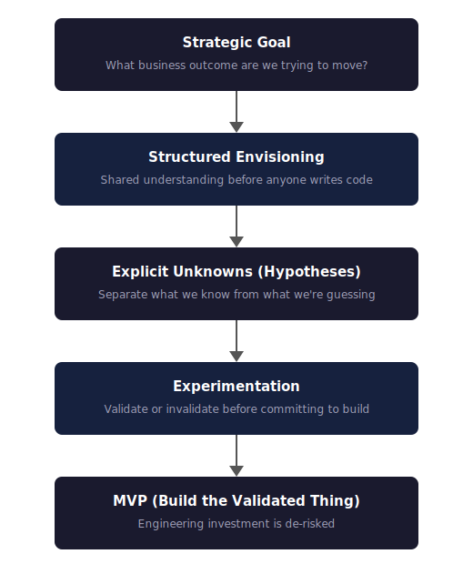

I've led numerous enterprise AI projects at Microsoft - across retail, automotive, government, healthcare, manufacturing. Some shipped and delivered real value. Some stalled, pivoted, or quietly got shelved. After a while, I started noticing a pattern.

The projects that failed didn't fail because of the technology. They failed because of how the work was framed. And I learned this by getting the framing wrong in two different directions.

## The first failure: building before you know

Early in my time at Microsoft, I was part of a project where the engineering team started building an MLOps platform while the data scientists were still waiting for data access. The logic seemed sound - the platform would be needed eventually, so why not get ahead? In hindsight, the work that looked most productive was happening furthest from the critical unknown.

The platform was solid. Well-architected, production-ready. But when the data science work matured, the limiting factor turned out to be the model, not the infrastructure. We hadn't yet validated whether any modelling approach could satisfy the production constraints of the use case. The explainable methods couldn't hit the required level of performance, and the better-performing alternatives didn't offer the consistency stakeholders needed. We'd invested months in platform engineering before proving the thing that actually determined whether the solution could ship.

Both teams had been busy. Both were productive on paper. But nobody had asked the critical question: do we know enough to justify building this yet?

I call this "activity theatre" - everyone is busy, but the project isn't actually progressing towards an outcome.

## The overcorrection: exploring without accountability

That experience left a mark. On my next project, I was determined not to repeat the mistake. We framed it as a feasibility study - de-risk before committing to build.

We explored whether a particular AI approach could solve the customer's problem. We tried several different models, including an experimental approach from a recent paper that we implemented from scratch and adapted to work in the domain.

We were really happy with ourselves. The engineering was strong. The experimental approach was genuinely novel.

None of the models got the results we wanted. The reason wasn't the modelling - it was the data. The data quality wasn't good enough for the use case.

So we pivoted. We stopped focusing on models and started exploring the data - digging into why it wasn't good enough, identifying the specific gaps. Based on what we found, we worked with the customer to collect new data that filled those gaps. Now we had a clear plan.

Here's the part that stuck with me: the model we used for all of that data validation work was the simplest one available. Well-supported, fast, consistent. We used it pretty much out of the box. It was probably a few percent worse than our experimental approach - but it was good enough. And because it was simple, when something didn't work, we knew it was a data problem, not a bug.

We'd spent weeks on modelling when the data should have been on the critical path from the start. We'd prioritised the interesting problem over the critical one.

Looking back, the root cause was that we hadn't been clear enough about the outcome we were trying to achieve. The framing was "explore whether this AI approach works" - solution-first, not outcome-first. If we'd started with a sharp objective - what does this need to deliver for the customer? - the data question would have been obvious. You can't achieve an outcome if the data won't support it.

The project worked out. But if we'd been strictly time-bound, following the same approach, it wouldn't have.

We ran several more feasibility studies after that. They were producing useful learning. But they were getting longer and longer. Eventually, we proposed one that could take two to three months. A stakeholder pushed back: "We are not a research lab. We are in production."

I started preparing to argue. Then I forced myself to see it from his side. The feasibility studies had been working - but we hadn't been intentional enough about keeping them focused. Without that discipline, they expanded. He didn't care which model performed best. He wanted to know if this would solve his problem.

He was right.

## The shift: from activity to outcome

Two failures, opposite directions. Build too early and you waste engineering investment on unvalidated assumptions. Explore too long and you lose accountability, drift into research, and exhaust stakeholder patience.

The underlying problem is the same: AI projects carry feasibility uncertainty, not just execution uncertainty. Agile handles execution well - priorities shift, you adapt. But it doesn't help when you don't yet know if the approach will work at all. Most AI projects have both kinds, and most teams only manage one.

That was the moment I stopped framing early AI work as feasibility studies. The framing had two problems. Customers and leadership heard "research" and got nervous - it sounded like we weren't confident we could deliver. And teams used it as an escape hatch. Open-ended exploration felt rigorous, but "it's not feasible" became a way to avoid accountability for outcomes.

Now I frame it as hypothesis validation. Not open-ended exploration, but bounded validation: what are the key unknowns? What's on the critical path? What do we need to prove before we commit to build?

Same work. Different framing. Completely different accountability.

Over time, I adapted hypothesis-driven development into a delivery approach for enterprise AI projects. I call it Hypothesis-Driven AI Delivery.

The core flow:

Let me walk through each step.

## 1. Start with the goal, not the solution

When someone says "we want to use AI," my first question is always: "To achieve what?"

Not what model do you want. Not what data do you have. What business outcome are you trying to move?

This question forces clarity. Vague ambitions become specific objectives. And half the time, the conversation that follows reveals they're not actually ready to start. That's not a failure - it's saving months of wasted effort.

The questions I work through:

-   What is the business problem, and why does it need to be solved?

-   How is it handled now, and how would a solution actually be used?

-   How should performance be measured - and is that measure aligned with the business objective?

-   Who will ultimately own the solution?

If you can't answer these clearly, you're not ready to build anything.

I've learned to treat it as an amber flag when a customer is more excited about the solution than the outcome. "We need a chatbot." "We want to build a knowledge graph." These aren't bad starting points - but they're means, not ends. The outcome might be "reduce interactions that require a human" or "surface the right context at the right time to enable faster decisions." When I hear more enthusiasm for the technology than clarity on what it needs to achieve, I slow down. That's usually a sign we need more conversation before anyone writes code.

## 2. Establish shared understanding through envisioning

Before any AI project, I run a structured workshop with data scientists, engineers, stakeholders, and subject matter experts. No code. No architecture discussions. Just alignment.

The goal is shared understanding: the problem domain, the business motivations, any previous work, and the hypotheses we'll explore - with agreed success criteria. What it's explicitly not: solutionising, technology debates, backlog creation, or code reviews.

One test I use early: think about the solution as a black box, and consider how a subject matter expert would solve this problem manually. What data would they need? If the available data wouldn't let a human expert make the judgement in any credible way, your model probably won't either. This surfaces data problems before you've written any code - and often reveals that you need different data than you assumed.

On one project, a manufacturing company wanted to predict when and why their production lines would fail. After a couple weeks of looking at the data and visiting one of their factories, it was clear: the data they collected was nowhere near what the use case required. The project pivoted to a BI focus, helping them understand what data they'd need to collect in future. One of my team, a new joiner, was disappointed. I helped him see it differently: we'd saved the company months of building toward something the data couldn't support. That's not a failure - that's a success you can only get by asking the right questions early.

Why this discipline? Because I've seen too many projects where the data scientists thought they were solving problem A, the engineers thought they were building for problem B, and the stakeholder actually wanted C. One focused conversation at the start prevents months of misalignment later.

The output is a document simple enough that someone outside the project could read it and understand what we're trying to achieve. If you can't write that document, you're not ready to start the project.

## 3. Make unknowns explicit

This is where vocabulary matters.

Teams often blur goal, objective, assumption, and hypothesis together. That sounds harmless, but it hides risk. I use them differently:

-   **Goal**: the overarching outcome.

-   **Objective**: a specific, measurable step toward it.

-   **Assumption**: a constraint we are accepting for now.

-   **Hypothesis**: an unknown we intend to prove or disprove.

The point is to separate what we know from what we're guessing. Most project plans are full of assumptions waiting to cause problems. Making them explicit is the first step to managing risk.

A good hypothesis is specific and testable. Not "we think this will work," but something concrete enough to validate or reject with evidence. For example: "Purchase and browse behaviour contains sufficient signal to differentiate customer segments."

Most teams resist writing hypotheses this way because it forces precision. That discomfort is the point.

## 4. Experiment before building

Don't build the full solution around an approach you haven't validated. Enabling work - data access, evaluation infrastructure, deployment paths - can and should run in parallel. What you're avoiding is irreversible investment in a specific approach before you know it works.

Experimentation isn't a phase you do once at the start - it's a tool you use throughout the project lifecycle. During discovery, during build, during production, post-launch. The question isn't "should we run experiments?" but "what do we need to validate at this stage?"

The goals of experimentation:

-   Establish solution feasibility given current constraints

-   Focus on finding answers rather than writing production code

-   Reduce risk by validating assumptions and other unknowns

-   Deliver objective and interpretable results

The mindset shift here is crucial: invalidating a hypothesis quickly is a win. It's not failure - it's valuable information that prevents wasted investment. It's far better to discover in week three that your approach doesn't work than to discover in month four after building a production system around it.

Teams are accountable for outcomes: validated learning, a clear decision, and an identified next step.

## 5. Build the validated thing

Validation earns the right to commit to MVP.

Now you know:

-   The approach works

-   The data is sufficient

-   The metrics correlate to business value

-   The critical assumptions hold

If you've run enabling work in parallel, you're not starting from zero. You're building the solution on a foundation you've already proven works.

But here's where I see teams stumble: the "minimal" in MVP gets lost. Stakeholders want everything at once. Features creep in. The MVP becomes a fully-featured product before it ever reaches users.

This defeats the entire point. You want signal fast. You want to get something in front of real users and see if it actually solves their problem. If it turns out the approach isn't useful, every additional feature you built was wasted effort.

The real learning doesn't happen in architecture reviews or stakeholder demos. It happens when real users interact with a real system. The logging, the feedback, the unexpected ways people use - or don't use - what you built. That's where you learn whether your hypotheses were right.

Resist the urge to polish before you've validated. Get to users. Learn. Then iterate.

## Putting it into practice

I capture all of this in a one-page template at the start of every project:

-   **Goal**: the business outcome we're trying to achieve.

-   **Assumptions**: what we're taking as given. (These are risks if they're wrong.)

-   **Objectives**: specific, measurable steps toward the goal.

-   **Hypotheses**: the unknowns we need to validate - each with testing methodology and success criteria.

If you can complete it, you're ready to start. If you can't, you need more conversation before anyone commits to build.

## A concrete example

The methodology didn't start as a methodology. It started as a set of mistakes I kept making until the pattern became obvious.

In 2018, before I'd formalised any of this, I was the ML lead at Marks & Spencer working on a personal styling service called Try Tuesday. The brief was to build a recommendation system that could replicate what human stylists did - suggest outfits tailored to each customer.

But when we applied outcome framing, "act like a human stylist" wasn't specific enough to build toward. The outcome the business actually cared about was this: *drive additional sales by presenting customers with items they would not otherwise have purchased without the recommendation*.

That reframing shaped every decision. It changed how we measured success - not just click-through rates, but whether recommendations drove purchases that wouldn't have happened otherwise. It changed how we thought about the data we needed. It changed the hypotheses we tested.

We explored whether we could measure similarity among items from their descriptions, whether customer purchase history could predict future purchases better than random, and whether we could identify complementary items that work together. Each was a testable hypothesis with clear success criteria. The approach worked, and the architecture was later integrated into M&S's broader recommendation platform.

In practice, that meant the project looked something like this:

-   **Goal**: Drive additional sales by recommending items customers wouldn't have purchased otherwise.

-   **Objective**: Demonstrate measurable uplift from personalised outfit recommendations.

-   **Assumption**: Customer behaviour and outfit data contain enough signal to learn which items work well together.

-   **Hypothesis**: Using item and behaviour signals, we can identify complementary products that drive more incremental purchases than the current approach.

That framing changed the work completely. We weren't trying to "build a stylist." We were trying to prove that better recommendations could change purchasing behaviour in a measurable way.

I wrote about the envisioning approach in 2021 - how to frame problems and define hypotheses at the start of a project. Since then, I've applied the full methodology across retail, automotive, government, healthcare, and manufacturing - different domains, different technologies, same approach.

What strikes me is how the pattern repeats. Recently, I worked with a major fashion retailer that wanted to improve their AI styling assistant. The initial framing was familiar: "We want it to behave more like a real stylist." "We want to increase customer engagement."

Same ask as Try Tuesday, years later, completely different technology.

When we dug in, stakeholders were conflating two different problems: the assistant didn't *know* the customer (personalisation), and it didn't *talk* like a fashion expert (conversational quality). These feel related, but they're different hypotheses with different solutions. Personalisation - knowing who someone is, what they've bought, what they avoid - would deliver measurable improvement. Prompt-tweaking for tone, while more visible, wouldn't move the metrics that mattered.

That distinction shaped everything. We scoped the work firmly around personalisation and defined testable hypotheses for each layer: could we build a unified view of the customer from their fragmented data? Could we use that context to make recommendations genuinely personal? Could we close the loop so every conversation made the next one better?

The technology has evolved dramatically - large language models, richer customer graphs, architectures that didn't exist when I was at M&S. But the approach was identical: start with the outcome, separate what you know from what you're guessing, and validate before you build.

The technology evolves fast. The failure modes don't. Teams still build before they know. Teams still explore without accountability.

Building something has never been easier. Building the right thing is as hard as it ever was.

The discipline is the same one I learned from getting it wrong: start with the outcome, separate what you know from what you're guessing, and validate before you build.
